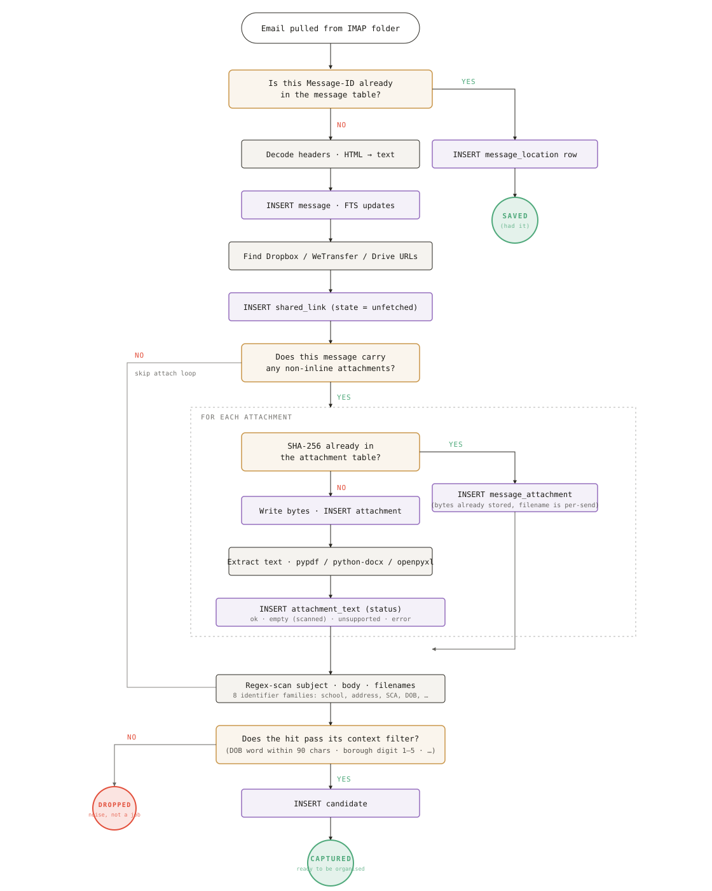
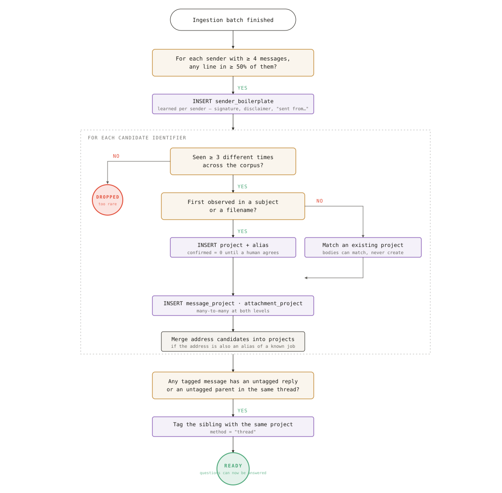
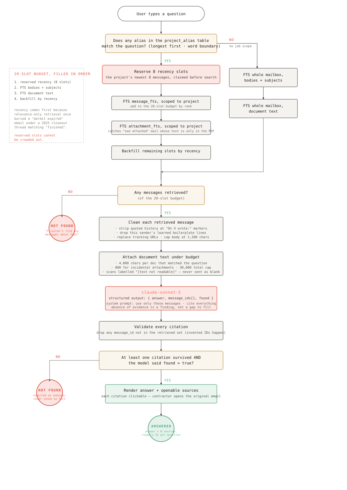

# Asbuilt

**AI email assitant for email providers that do not natively have one**

Gmail and Outlook are adding AI features. Yahoo, AOL, and the many other IMAP-based providers that small businesses (specifically construction) still rely on mostly are not. Asbuilt connects to any IMAP inbox, organizes years of email into clean project records, and answers plain-English questions with citations back to the original emails.

It was built for NYC specialty subcontractors (plumbers, electricians, HVAC shops), whose entire business often runs through one crowded inbox: bids, change orders, permits, submittals, and payment applications, all mixed with spam and service calls.

---
## Status

Asbuilt is an early-stage project. It has been developed and tested against a real NYC contractor's inbox of roughly 20,000 emails and 13,000 attachments. That data is private and is not included in this repository.

## What it does

**Ask your inbox anything.** Type a question like *"When did the permit for (Project) expire?"* and get a short answer with clickable sources. Every claim links to the email it came from, so you can check it in one click.

**Projects organize themselves.** Asbuilt reads subjects, bodies, and attachment names to detect job identifiers, then groups every related email and document under the right project. It handles the messy reality of construction email, where one job can go by many names due to the lack of standardization.

**Attachments become searchable.** Text is extracted from PDFs, Word documents, and spreadsheets, so answers can come from a pay application or a submittal, not just the email that carried it.

**Works with any IMAP provider.** Yahoo, AOL, Gmail, and more. No OAuth integration or provider-specific API is required.

---

## Accuracy

A wrong answer about a permit or a payment has real consequences, so Asbuilt is designed around a few rules:

- **Every answer is cited** The model returns the IDs of the emails it used, and each one is checked against what was actually retrieved. Invented citations are dropped, and an answer with no valid citations is reported as "not found" instead of being shown as fact.
- **"I don't know is an answer** If the evidence isn't in the inbox, Asbuilt says so rather than guessing.
- **Humans confirm** New projects are created as unconfirmed suggestions until a person approves them.
- **Read-only access** Asbuilt never modifies or deletes anything in the connected mailbox.
- **Data stays local** Email is stored in a local SQLite database, not a shared cloud service.

---

## How it works

Asbuilt runs in three stages.

### 1. Capture every email

Each message is pulled over IMAP, deduplicated, and stored with its attachments and shared links (Dropbox, WeTransfer, Google Drive). Attachments are content-addressed by SHA-256, so a file sent ten times is stored once. The text of each message is then scanned for anything that looks like a job identifier.



### 2. Organize into projects

After each sync, Asbuilt learns each sender's signature and disclaimer lines so they don't pollute results. It then turns recurring identifiers into projects, links messages and documents to them, and extends project tags across email threads.



### 3. Answer questions

When a question names a project, Asbuilt retrieves that project's most recent emails plus the most relevant messages and documents, cleans them up, and sends them to Claude with instructions to answer only from that evidence. Citations are validated before anything is shown. A typical question costs about 4 cents.



---

## Tech stack

| Layer | Tools |
| --- | --- |
| Language | Python 3.12 |
| Email | IMAP (`imaplib`), with resumable, idempotent sync |
| Storage | SQLite with FTS5 full-text search (16-table schema) |
| Documents | `pypdf`, `python-docx`, `openpyxl` |
| AI | Anthropic Claude API with structured outputs |
| Web app | Flask, with password login and 30-day sessions |

---

## How to start

**1. Install dependencies**

```bash
pip install -r requirements.txt
```

**2. Configure your inbox and API key**

```bash
cp .env.example .env
```

Fill in your IMAP host, email address, and app password, plus an Anthropic API key from [console.anthropic.com](https://console.anthropic.com). Yahoo and Gmail both require an app password rather than your normal password.

**3. Create the database**

```bash
mkdir data
sqlite3 data/asbuilt.db < schema.sql
```

**4. Sync and organize your inbox**

```bash
python refresh.py
```

This runs every stage in order: ingest, learn boilerplate, extract identifiers, resolve projects, and extract document text. Each stage only processes what's new, so later runs take seconds.

**5. Launch the app**

```bash
python app.py
```

On first launch, a login passphrase is printed to the terminal.

---

## Project structure

| File | Purpose |
| --- | --- |
| `ingest.py` | Pulls email, attachments, and shared links over IMAP |
| `learn_boilerplate.py` | Learns each sender's signature and disclaimer lines |
| `extract_candidates.py` | Finds possible job identifiers in subjects, bodies, and filenames |
| `resolve_projects.py` | Turns identifiers into projects and assigns messages to them |
| `extract_documents.py` | Extracts text from PDF, Word, and Excel attachments |
| `assistant.py` | Retrieval, the Claude call, and citation validation |
| `app.py` | Web app: project list, timelines, search, and Ask |
| `label.py` | Labeling tool for measuring precision and recall |
| `refresh.py` | Runs the full pipeline in dependency order |
| `auth.py` | Login and session handling |
| `schema.sql` | Database schema |
| `audit_inbox.py`, `folder_census.py`, `project_trace.py` | Exploratory tools used to study a real inbox before designing the pipeline |
| `docs/` | Workflow diagrams and a longer explainer, [How Asbuilt works](docs/how-asbuilt-works.html) |

---

## Roadmap

- **Per-client memory:** learn facts from past questions (who the GC is, who handles billing) and use them in future answers, with human review before anything is saved
- **Live sync** instead of manual refreshes
- **Document types:** recognize RFIs, submittals, pay applications, and insurance certificates
- **Status tracking:** know whether a submittal was approved or an RFI answered
- **Multi-mailbox companies:** combine the owner's, office manager's, and estimating inboxes into one record

---


